```{r setup, include=FALSE}
knitr::opts_chunk$set(echo = TRUE)

library(tidyverse)
```

R studio has become a standard tool for R. It provides a user friendly interface to write and execute code by hybridinzing scripts with a point-and-click interface. There are already great resources going going over RStudio that go way beyond what I will discuss here. If you are interested in learning more check out: https://rstudio.com/wp-content/uploads/2016/01/rstudio-IDE-cheatsheet.pdf

# Part 1: RStudio orientation

RStudio offers users to customize the interface to create a space that works best for them. However, there are four basic windows to be aware of:

### 1) _The source pane_ - this is where you can write and edit code, insert text for reports, and generally get work done.
<br/>  

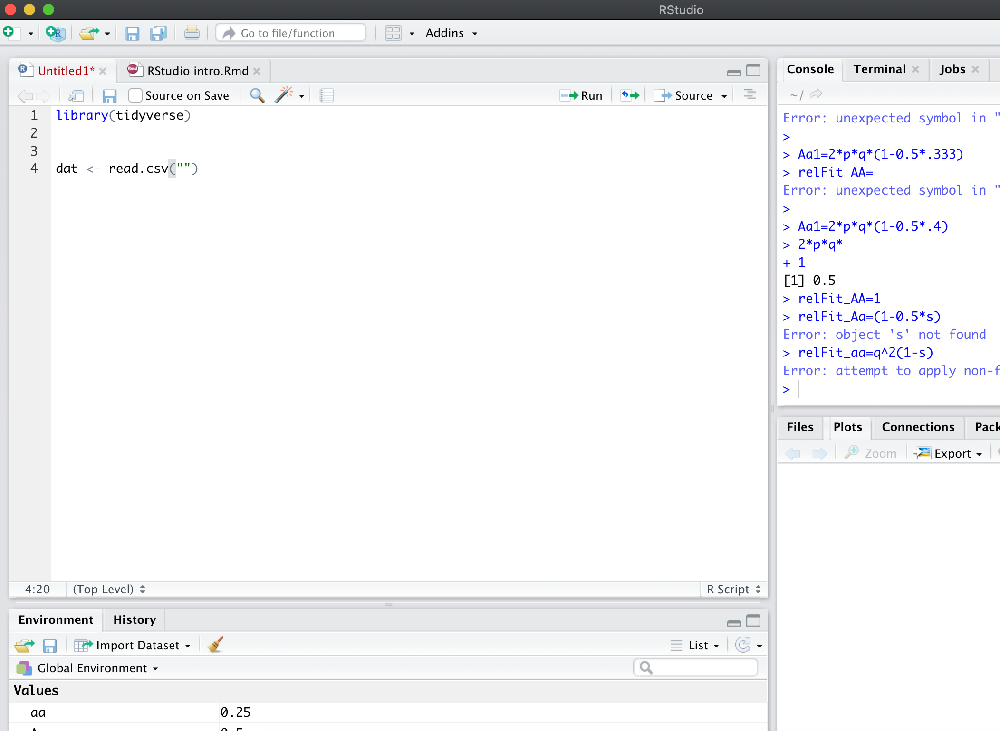{width=75%}


### 2) _The Console_ - this is your traditional R view. Here you can script just like you would in the original R, code is execulted by pressing enter and stored in your history.
<br/>  


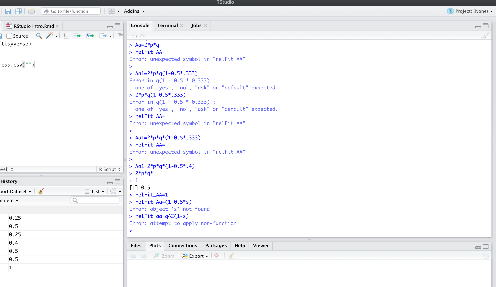{width=75%}
<br/>  

### 3) _Plots, Packages, and Help_ - This is a viewer pane that provides quick access to viewing plots, installing packages, reading help pages.

#### _Print a plot from the source or console pain, and then view or export the file from the viewer:_
<br/>  

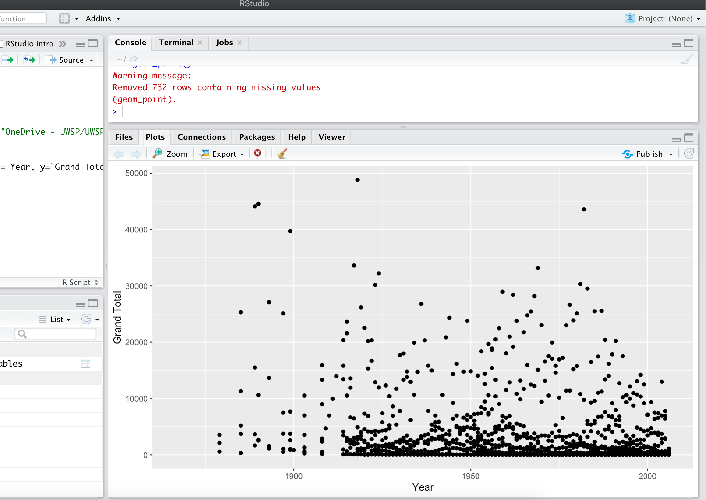{width=75%}

<br/>  

#### _View all of the packages you have installed, or install new packages_
<br/>  

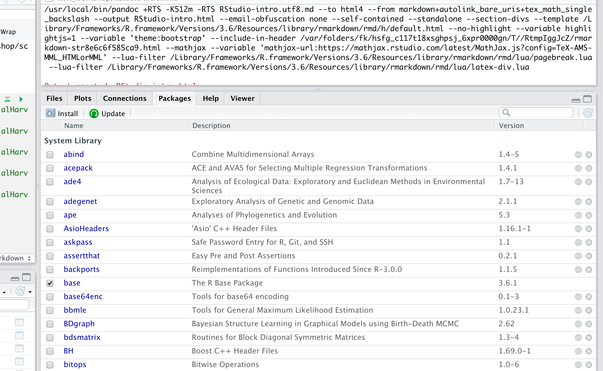{width=75%}

<br/>  

#### _Pull up help files for functions and packages_
<br/>  


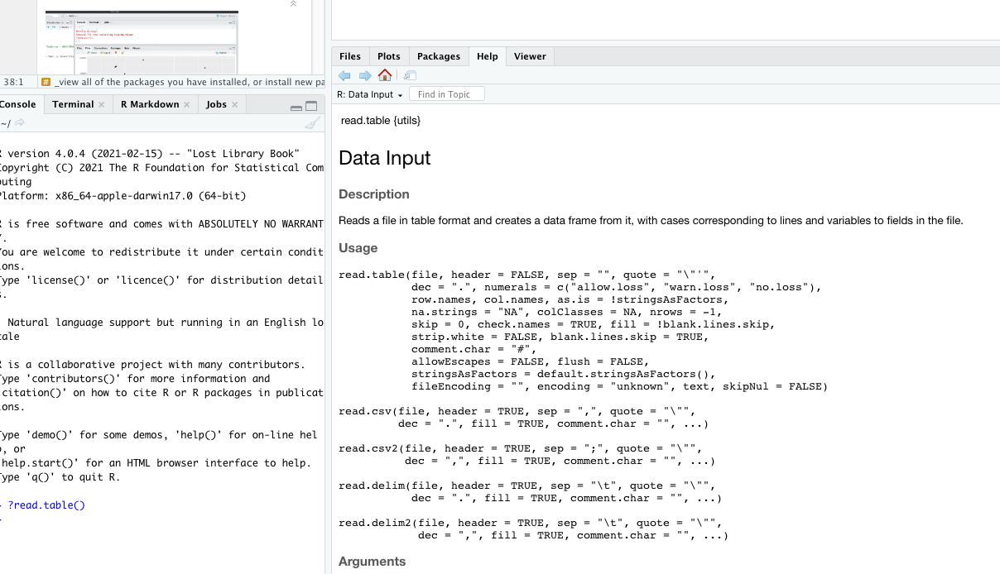{width=75%}
<br/>  

### 4) _Environement_ - This is where you can preview what data you have loaded in to R and manage functions and or history.

#### _View different datasets that you have loaded an check to make sure you know what variables or funcitons you have loaded._

<br/>  


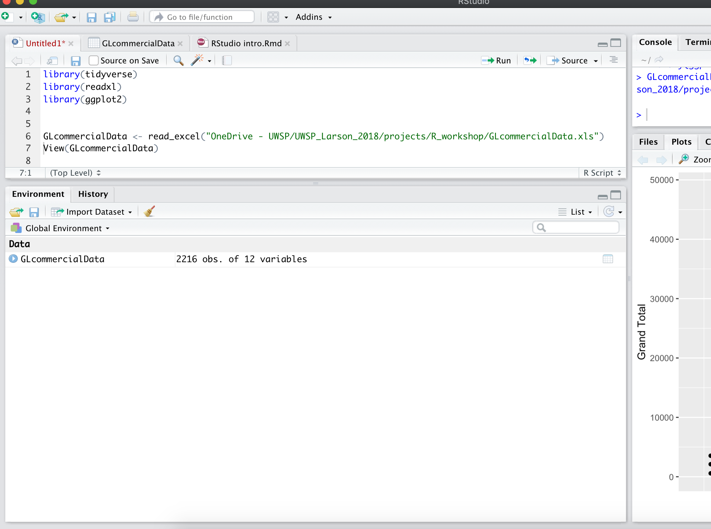{width=75%}

<br/>  

#### _Look back at your history and even move code that you wrote in the "console" back to your official script in the "Source" pain._
<br/>  

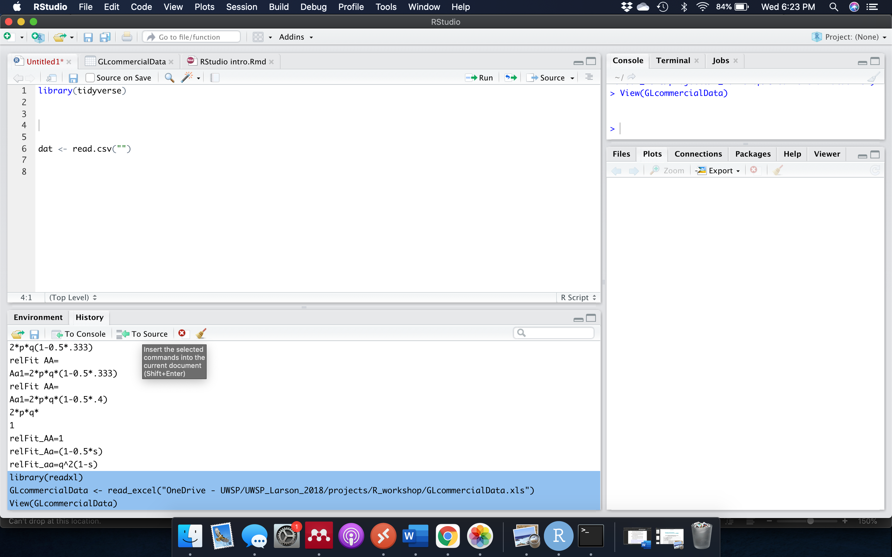{width=75%}


<br/>  

### The layout of these panes is up to you can can be customized by clicking on the "Workspace Panes" icon with 4 little boxes on the top bar.
<br/>  

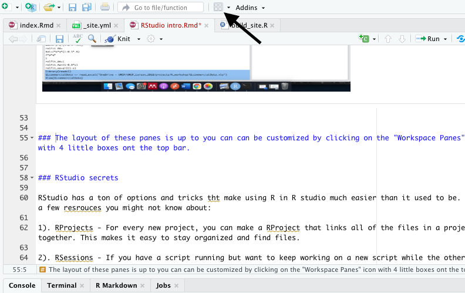{width=75%}

---- 

## Part 2: RStudio secrets

### RStudio has a ton of options and tricks that make using R in R studio much easier than it used to be. Here are a few resrouces you might not know about:
<br/>  

#### _1). RProjects - For every new project, you can make a RProject that links all of the files in a project folder together. This makes it easy to stay organized and find files._
<br/>  

#### _2). RSessions - If you have a script running but want to keep working on a new script while the other runs, you can open new session. This allows you to get something else started while your model is running._
<br/>  

#### _3). RMarkdown, Shiny Apps, and presentations - RStudio allows you to create different types of documents and us R code to do a lot more than just statistics. See Alex about getting started with RMarkdown and Shiny._ 
<br/>  

#### _4). Easy help and cheatsheets - You may know that "?function()" pulls up a help page, but RStudio also makes it easy to access lots of pre-built cheatsheets for different common packages and syntax under the "Help" tab._
<br/>  

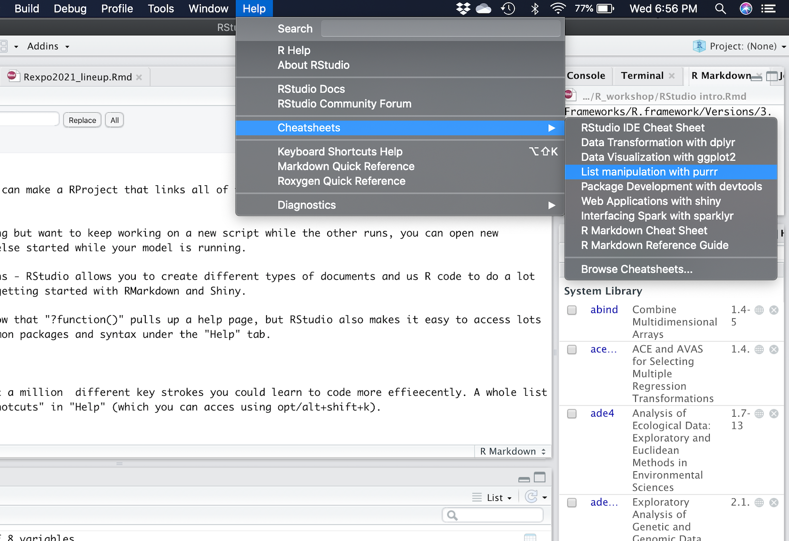{width=75%}

<br/>  

#### _5). Use the magnifying glass to search and replace to quickly re-name variables (or correct mistakes)._
<br/>  

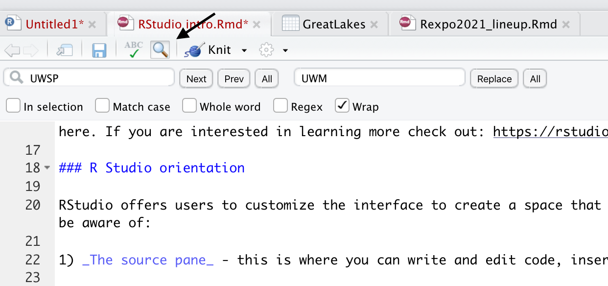{width=75%}

<br/>  

#### _6). If you are working on a report (Check out Alex Latzka's talk) you can spell check your work_

<br/>  

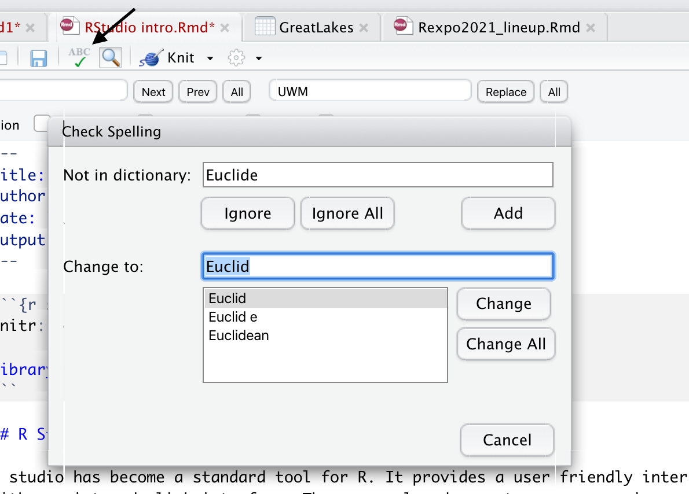{width=75%}

<br/>  

#### *7). Important files using the "Import Dataset" button in the environment panel:*

<br/>  

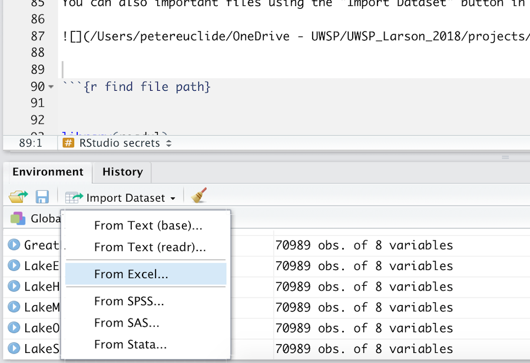{width=75%}

<br/>  

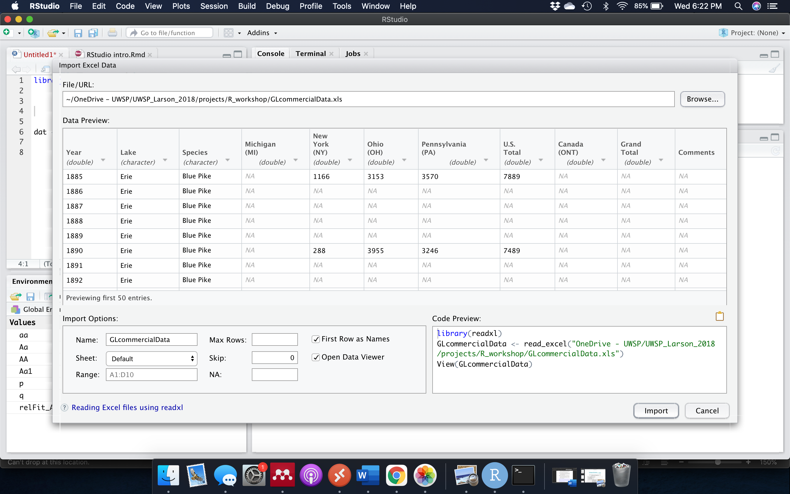{width=75%}

<br/>  

#### _8). Hotkeys, hotkeys, hotkeys - R has about a million  different key strokes you could learn to code more efficiently A whole list is easily accessible under the "Keyboard Shortcuts" in "Help" (which you can access using opt/alt+shift+k)._ 


##### Press tab when typing a file path to view all files in the present folder.
##### Press cmd+opt+i to insert a new code chunk
##### Press cmd+enter to run a line of code
##### Press command + shift + c to comment blocks of code (or un-comment)
##### Press opt + - to name a new variable

<br/>  

---

##### Press and hold option to enter "column mode"
  
<br/>  
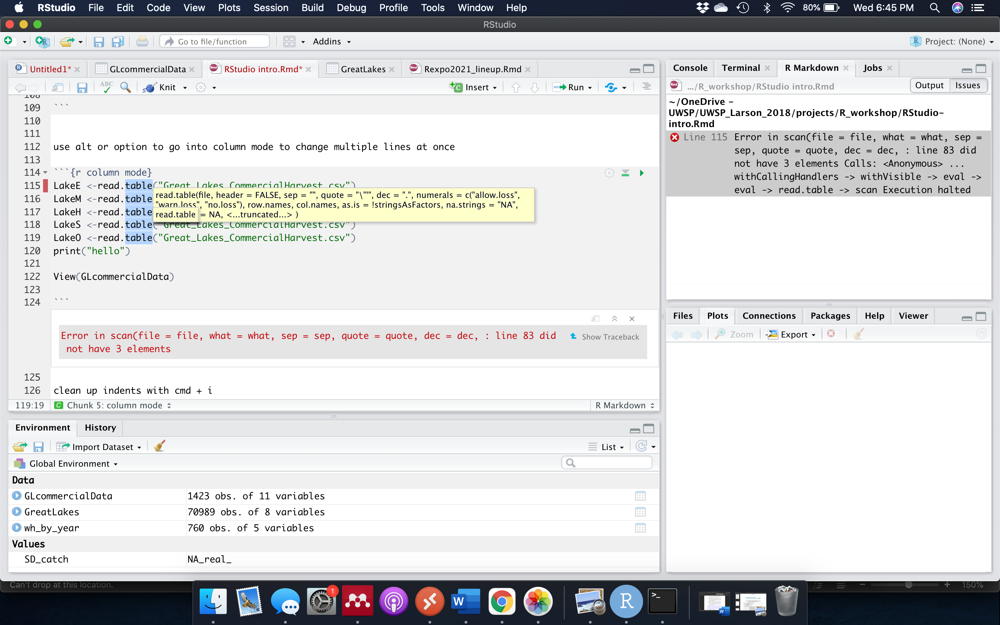{width=75%}

<br/>  

---

##### clean up indents with cmd + i

<br/>  

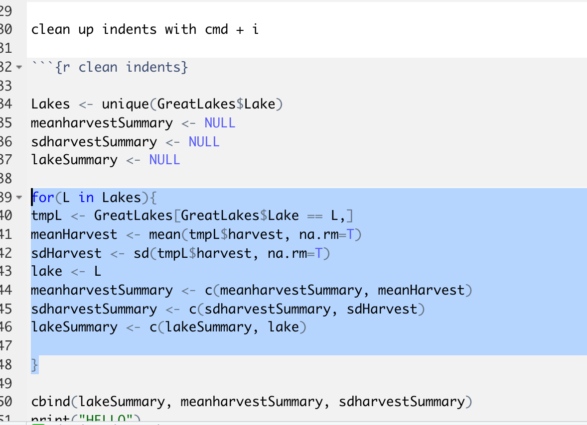{width=75%}
<br/>  

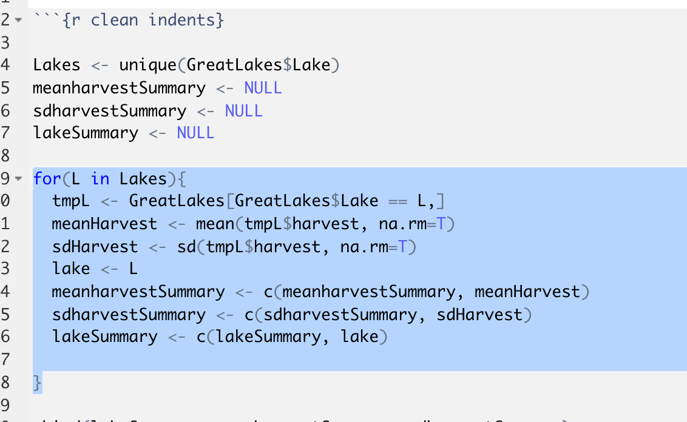{width=75%}

<br/> 

<br/>  

---

### There is a lot more that RStudio can do to make it easier to learn R. The best way to learn is to spend some exploring the RStudio environment by clicking around on the different tabs and buttons. 


---

---