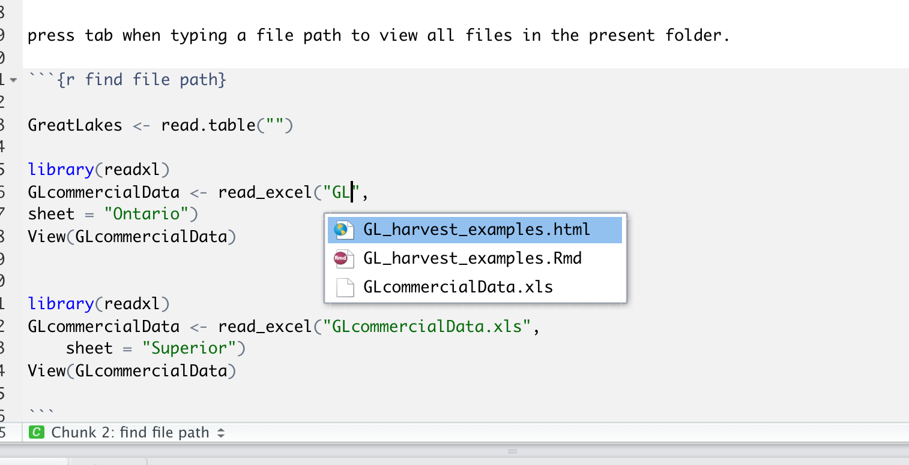

```{r setup, include=FALSE}
knitr::opts_chunk$set(echo = TRUE)

library(tidyverse)
```

## R Studio

R studio has become a standard tool for R. It provides a user friendly interface to write and execute code by hybridinzing scripts with a point-and-click interface. There are already great resources going going over RStudio that go way beyond what I will discuss here. If you are interested in learning more check out: https://rstudio.com/wp-content/uploads/2016/01/rstudio-IDE-cheatsheet.pdf

### R Studio orientation

RStudio offers users to customize the interface to create a space that works best for them. However, there are four basic windows to be aware of:

1) _The source pane_ - this is where you can write and edit code, insert text for reports, and generally get work done.

{width=75%}


2) _The Console_ - this is your traditional R view. Here you can script just like you would in the original R, code is execulted by pressing enter and stored in your history.


{width=75%}

3) _Plots, Packages, and Help_ - This is a viewer pane that provides quick access to viewing plots, installing packages, reading help pages.

Print a plot from the source or console pain, and then view or export the file from the viewer:

{width=75%}


You can also view all of the packages you have installed, or install new packages.

{width=75%}


4) _Environement_ - This is where you can preview what data you have loaded in to R and manage functions and or history.

View different datasets that you have loaded an check to make sure you know what variables or funcitons you have loaded.

{width=75%}

Look back at your history and even move code that you wrote in the "console" back to your official script in the "Source" pain.

{width=75%}


The layout of these panes is up to you can can be customized by clicking on the "Workspace Panes" icon with 4 little boxes ont the top bar.


### RStudio secrets

RStudio has a ton of options and tricks tht make using R in R studio much easier than it used to be. Here are a few resrouces you might not know about:

1). RProjects - For every new project, you can make a RProject that links all of the files in a project folder together. This makes it easy to stay organized and find files.

2). RSessions - If you have a script running but want to keep working on a new script while the other runs, you can open new session. This allows you to get something else started while your model is running.

3). RMarkdown, Shiny Apps, and presentations - RStudio allows you to create different types of documents and us R code to do a lot more than just statistics. See Alex about getting started with RMarkdown and Shiny. 

4). Easy help and cheatsheets - You may know that "?function()" pulls up a help page, but RStudio also makes it easy to access lots of pre-built cheathseets for different common packages and syntax under the "Help" tab.

{width=75%}

5). Use the magnifying glass to search and replace to quickly re-name variables (or correct mistakes).

{width=75%}


6). If you are working on a report (Check out Alex Latzka's talk) you can spell check your work.

{width=75%}


5). Hotkeys, hotkeys, hotkeys - R has about a million  different key strokes you could learn to code more effieecently. A whole list is easily accessible under the "Keyboard Shotcuts" in "Help" (which you can acces using opt/alt+shift+k). 

a few to keep in mind:

press tab when typing a file path to view all files in the present folder.

{width=75%}


You can also important files using the "Import Dataset" button in the environment panel:

{width=75%}

{width=75%}


```{r find file path}


library(readxl)

GLcommercialData <- read_excel("GLcommercialData.xls",
sheet = "Ontario")
#View(GLcommercialData)


GLcommercialData <- read_excel("GLcommercialData.xls", 
    sheet = "Superior")
#View(GLcommercialData)

```

Use cmd+alt+i to create a new chunk in a RMarkdown file


use comand + shift + c to comment code (or uncomment)

```{r comment}

GreatLakes <- read.csv("Great_Lakes_CommercialHarvest.csv")
summary(GreatLakes$Year)

SD_catch = sd(GreatLakes$harvest)

wh_by_year <- GreatLakes %>% filter(Species == "Lake Whitefish") %>%
group_by(Lake, Year) %>%
summarize(Total_catch = sum(harvest, na.rm = T),
Mean_catch = mean(harvest, na.rm = T),
SD_catch = sd(harvest, na.rm = T))

head(wh_by_year)

```


use alt/opt + - to name a new variable

```{r new variable}

lakeErie <- subset(GreatLakes, Lake == "Erie")

```


use alt or option to go into column mode to change multiple lines at once

{width=75%}


```{r column mode}
LakeE <-read.csv("Great_Lakes_CommercialHarvest.csv") 
LakeM <-read.csv("Great_Lakes_CommercialHarvest.csv") 
LakeH <-read.csv("Great_Lakes_CommercialHarvest.csv") 
LakeS <-read.csv("Great_Lakes_CommercialHarvest.csv") 
LakeO <-read.csv("Great_Lakes_CommercialHarvest.csv") 

#View(GLcommercialData)

```

clean up indents with cmd + i

{width=75%}

{width=75%}


```{r clean indents}

Lakes <- unique(GreatLakes$Lake)
meanharvestSummary <- NULL
sdharvestSummary <- NULL
lakeSummary <- NULL

for(L in Lakes){
  tmpL <- GreatLakes[GreatLakes$Lake == L,]
  meanHarvest <- mean(tmpL$harvest, na.rm=T)
  sdHarvest <- sd(tmpL$harvest, na.rm=T)
  lake <- L
  meanharvestSummary <- c(meanharvestSummary, meanHarvest)
  sdharvestSummary <- c(sdharvestSummary, sdHarvest)
  lakeSummary <- c(lakeSummary, lake)
  
}

cbind(lakeSummary, meanharvestSummary, sdharvestSummary)


```


