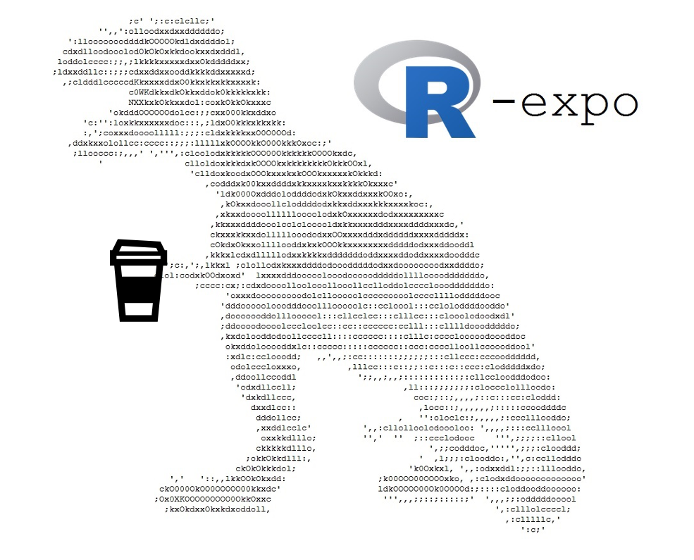

```{r setup, include=FALSE}
knitr::opts_chunk$set(echo = FALSE)
```

All presentations were held live February 9th and 11th during the [2021 Wisconsin Chapter meeting of the American Fisheries Society](https://wi-afs.org/annual-meetings/).

{width=50%}


---

## Presentation resources:

-	[Getting the most out of RStudio](RStudio-intro.html) – Peter Euclide, UW-Milwaukee

-	[Introduction to dataRetrieval and other USGS R resources](https://waterdata.usgs.gov/blog/dataretrieval/) – Larua DeCicco, USGS

-	__Make your computer work for you: Interactive applications and automated reports with R__ – Alex Latzka, WI DNR

-	__[arcpullr](arcpullr_vignette.html) and [wdnr.gis](wdnr.gis_vignette.html): Two new R packages for pulling spatial data into R__ – Paul Frater, WI DNR

-	__Back to the basics – quick refresher of basic plots and stats in R__ – Zach Feiner, WI DNR

-	[Making better graphs – publication ready plots in ggplot](intro_to_ggplot2.html) – Holly Embke, UW-Madison

-	[Working with stream data in R: linking fish, flows, temperature, habitat, and watershed info](StreamData_master-script.html) – Bryan Maitland, WI DNR

## Additional R resources:

- [USGS-R Github](https://github.com/USGS-R)

- [USGS Official Code repositories](https://code.usgs.gov/water)

- [USGS Official R-Blog series](https://waterdata.usgs.gov/blog/tags/r/)

- [FishR](http://derekogle.com/fishR/)

- [RStudio Cheatsheets](https://rstudio.com/resources/cheatsheets/)

- [RStudio Education](https://education.rstudio.com)

## Useful packages for fisheries managers

+ toxEval: [http://usgs-r.github.io/toxEval/](http://usgs-r.github.io/toxEval/)
+ EGRET: [http://usgs-r.github.io/EGRET/](http://usgs-r.github.io/EGRET/)
+ FSA: [http://derekogle.com/FSA/](http://derekogle.com/FSA/)
+ RFishBC: [https://derekogle.com/RFishBC/](https://derekogle.com/RFishBC/)


---

---
